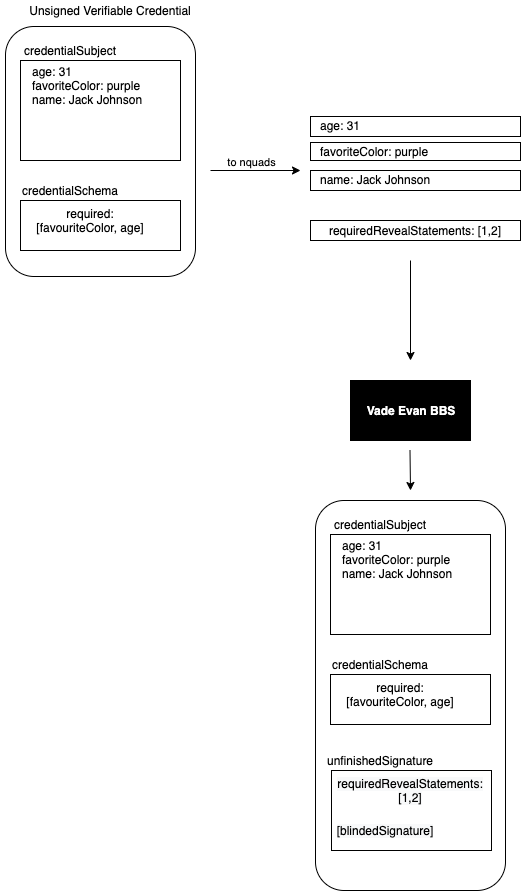

# VADE-EVAN-BBS

### Signature Workflow

At the time of writing, no suitable Rust library for serializing JSON-LD documents to [nquads](https://www.w3.org/TR/n-quads/) is available.
Thus, until this problem is solved, this plugin accepts only flat strings as values to be signed as flat strings, which are implicitly expected to be nquads.
This also means that the plugin cannot match the nquad index to its property name in the credential (schema).
Thus, the required indices also have to be provided explicitly and at this point this plugin has no means to match the provided required indices with the property names marked as required in the credential schema.

